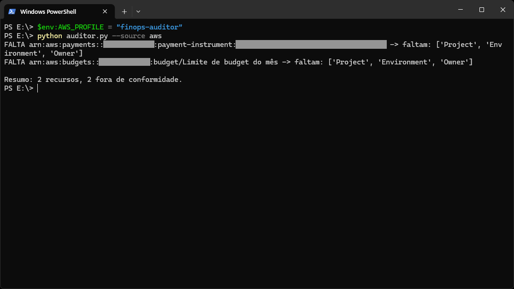

# FinOps Tag Auditor 

**🇺🇸 English** · [🇧🇷 Português](#português)

A small Python tool that scans cloud resources and flags the ones **missing
required cost-allocation tags** (`Project`, `Environment`, `Owner`). Untagged
resources are cost that can't be attributed to a team or project — one of the
first things a FinOps practitioner needs to fix.

> **Work in progress.** Runs against built-in sample data by default, and can
> read real resources from AWS (read-only, via `boto3`) with `--source aws`.

## Motivation

This is the **enforcement** side of tagging. In my
[AWS high-availability project](https://github.com/rcarra-arq/aws-highly-available-webapp-terraform)
I *apply* standardized tags with Terraform; this tool *checks* that they
actually landed on every resource — including the tricky case of instances
launched at runtime by an Auto Scaling Group, which don't inherit the
provider's default tags. Same "trust, but verify" idea as my S3 backup verifier.

## What it does 

Given a list of resources and their tags, it reports which required tags are
missing, one line per resource:

```
OK    bucket-acervo-fotos
FALTA bucket-teste-antigo -> faltam: ['Project', 'Environment', 'Owner']
FALTA vol-do-servidor -> faltam: ['Owner']
```

## How to run

Install dependencies once:

```bash
pip install -r requirements.txt
```

Run against the built-in sample data (no AWS credentials needed):

```bash
python auditor.py
```

Run against your real AWS account (read-only):

```bash
python auditor.py --source aws
```

Require a different set of tags, or skip services that can't be tagged:

```bash
python auditor.py --required-tags Project Owner CostCenter
python auditor.py --source aws --exclude-service payments
```



### Exit codes

The tool is meant to run in a pipeline, so it signals its result via the exit code:

| Code | Meaning |
|------|---------|
| `0`  | All resources compliant |
| `1`  | Found resources missing required tags (a CI step can fail the build) |
| `2`  | The tool could not run (missing AWS permission or credentials) |

### AWS permissions

`--source aws` uses the Resource Groups Tagging API and needs a **dedicated
read-only identity** — not an operational user. The minimum policy it requires
is in [`docs/iam-policy.json`](docs/iam-policy.json). Read access to S3 alone is
*not* enough: listing tags is a separate permission (`tag:GetResources`).

## Known limitations

These come from the AWS Resource Groups Tagging API itself, not from the tool:

- **Some services are listed but can't be tagged.** The API returns resources
  from the `payments` service (a saved credit card, `payment-instrument`), but
  AWS doesn't allow tags on them — so they always show up as non-compliant.
  Skip them with `--exclude-service payments`.
- **Never-tagged S3 buckets don't appear.** The Tagging API only returns a
  bucket once it has had at least one tag. A bucket that was never tagged is
  simply absent from the audit — check it with
  `aws s3api get-bucket-tagging --bucket <name>` before assuming a permissions
  problem.

## Roadmap

- [x] Core check: required tags per resource, one-line report
- [x] Read real resources from AWS (`boto3`, dedicated read-only IAM identity)
- [x] Summary counts (compliant vs. non-compliant)
- [x] CI-friendly exit codes
- [x] Configurable required-tag list (`--required-tags` flag)
- [x] Skip services that can't be tagged (`--exclude-service` flag)
- [x] Machine-readable output (`--format json|csv`)

*A study and portfolio project, built step by step while I learn Python and
FinOps hands-on.*

---

## Português

[🇺🇸 English ⬆](#finops-tag-auditor)

Uma pequena ferramenta em Python que varre recursos de nuvem e sinaliza os que
estão **sem as tags obrigatórias de alocação de custo** (`Project`,
`Environment`, `Owner`). Recurso sem tag é custo que não dá para atribuir a um
time ou projeto — uma das primeiras coisas que um profissional de FinOps
precisa corrigir.

> **Em desenvolvimento.** Roda com dados de exemplo embutidos por padrão e pode
> ler recursos reais da AWS (somente leitura, via `boto3`) com `--source aws`.

### Motivação

Este é o lado da **fiscalização** do tagging. No meu
[projeto de alta disponibilidade na AWS](https://github.com/rcarra-arq/aws-highly-available-webapp-terraform)
eu *aplico* tags padronizadas com Terraform; esta ferramenta *verifica* se elas
realmente chegaram em todos os recursos — incluindo o caso complicado de
instâncias criadas em tempo de execução por um Auto Scaling Group, que não
herdam as tags padrão do provider. A mesma ideia de "confie, mas verifique" do
meu verificador de backup do S3.

### O que ela faz

A partir de uma lista de recursos e suas tags, ela informa quais tags
obrigatórias estão faltando, uma linha por recurso:

```
OK    bucket-acervo-fotos
FALTA bucket-teste-antigo -> faltam: ['Project', 'Environment', 'Owner']
FALTA vol-do-servidor -> faltam: ['Owner']
```

### Como rodar

Instale as dependências uma vez:

```bash
pip install -r requirements.txt
```

Rode com os dados de exemplo embutidos (não precisa de credenciais AWS):

```bash
python auditor.py
```

Rode na sua conta AWS real (somente leitura):

```bash
python auditor.py --source aws
```

Exija um conjunto diferente de tags, ou ignore serviços que não podem ser
tagueados:

```bash
python auditor.py --required-tags Project Owner CostCenter
python auditor.py --source aws --exclude-service payments
```


#### Códigos de saída

A ferramenta foi feita para rodar em um pipeline, então sinaliza o resultado
pelo código de saída:

| Código | Significado |
|--------|-------------|
| `0`    | Todos os recursos em conformidade |
| `1`    | Encontrou recursos sem as tags obrigatórias (um passo de CI pode falhar o build) |
| `2`    | A ferramenta não conseguiu rodar (falta de permissão ou credenciais AWS) |

#### Permissões AWS

`--source aws` usa a Resource Groups Tagging API e precisa de uma **identidade
dedicada e somente leitura** — não de um usuário operacional. A política mínima
necessária está em [`docs/iam-policy.json`](docs/iam-policy.json). Ter acesso de
leitura só ao S3 *não* basta: listar tags é uma permissão separada
(`tag:GetResources`).

### Limitações conhecidas

Estas vêm da própria AWS Resource Groups Tagging API, não da ferramenta:

- **Alguns serviços aparecem mas não podem ser tagueados.** A API retorna
  recursos do serviço `payments` (um cartão de crédito salvo,
  `payment-instrument`), mas a AWS não permite tags neles — então eles sempre
  aparecem como não conformes. Ignore-os com `--exclude-service payments`.
- **Buckets S3 que nunca foram tagueados não aparecem.** A Tagging API só
  retorna um bucket depois que ele teve pelo menos uma tag. Um bucket que nunca
  foi tagueado simplesmente não aparece na auditoria — verifique com
  `aws s3api get-bucket-tagging --bucket <nome>` antes de assumir que é problema
  de permissão.

### Roadmap

- [x] Verificação principal: tags obrigatórias por recurso, relatório de uma linha
- [x] Ler recursos reais da AWS (`boto3`, identidade IAM dedicada somente leitura)
- [x] Contagem de resumo (conformes vs. não conformes)
- [x] Códigos de saída amigáveis a CI
- [x] Lista de tags obrigatórias configurável (flag `--required-tags`)
- [x] Ignorar serviços que não podem ser tagueados (flag `--exclude-service`)
- [x] Saída legível por máquina (`--format json|csv`)

---

*Projeto de estudo e portfólio, construído passo a passo enquanto aprendo
Python e FinOps na prática.*
